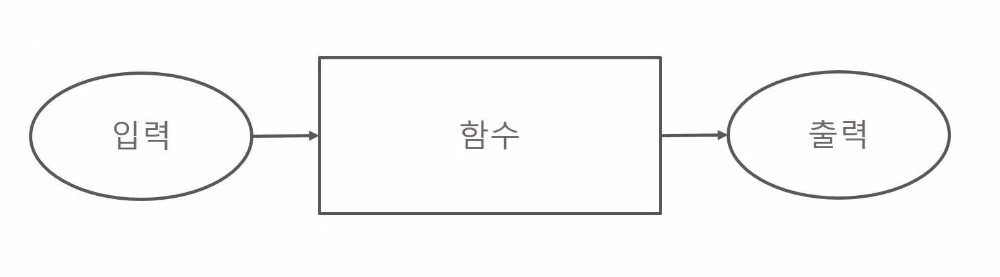

# 함수

## Contents

- [함수의 개념](#함수의-개념)
- [재귀함수](#재귀함수)


### 함수의 개념

- 함수는 입력을 받아 처리한 뒤에 출력하는 구조를 가짐

  

- 함수의 형태

  ``` c
  반환자료형 함수명(매개변수) {
      // 수행될 명령어
      return 반환할 값;
  }
  ```

- 함수의 호출

  ``` c
  함수명(매개변수);
  ```


### 재귀함수

- 재귀함수란 자기 자신을 포함하는 함수이다

- 기본적으로 자기 자신을 계속 불러낸다

- 따라서 반드시 재귀 종료 조건이 필요하다

  ``` c
  int factorial(int priorNumber) {
  	if (priorNumber == 1) return 1;
  	else return priorNumber * factorial(priorNumber - 1);
  }
  
  // 5! = 5 * 4 * 3 * 2 * 1 = 120
  printf("%d\n", factorial(5)); // 120
  ```

  