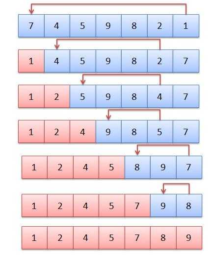
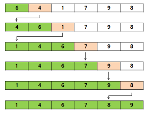

# 정렬 알고리즘

### Contents

- [선택 정렬(Selection sort)](#선택-정렬Selection-Sort)
- [삽입 정렬(Insertion sort)](#삽입-정렬Insertion-sort)


## 선택 정렬(Selection sort)

- **가장 작은것** 을 선택해서 앞으로 보내는 정렬 기법
- **가장 작은것** 을 선택하는데에 **N** 번 앞으로 보내는데에 **N** 번의 연산으로 **O(N<sup>2</sup>)** 의 시간복잡도를 가진다



``` c
#define _CRT_SECURE_NO_WARNINGS
#include <stdio.h>
#include <limits.h>

int swap(int* a, int* b) {
	int temp = *a;
	*a = *b;
	*b = temp;
}

int main(void) {

	int arr[10] = {3, 6, 2, 10, 7, 9, 5, 1, 4, 8};
	int size = sizeof(arr) / sizeof(int); // 배열에 넣을 데이터 갯수
	int min; // 정렬 기준을 정할 가장 작은 값
	int index; // 위치를 바꿔줄 인덱스

	// 데이터의 갯수만큼 반복
	for (int i = 0; i < size; i++) {
		
		// 최소값을 int 타입의 최대 값으로 초기화
		min = INT_MAX;

		// 현재 인덱스 i 부터 배열의 끝까지 반복
		for (int j = i; j < size; j++) {

			// 배열을 돌면서 현재 인덱스의 값이 min의 값보다 작은 경우
			if (min > arr[j]) {
				min = arr[j]; // min 값을 현재 인덱스의 값으로 업데이트
				index = j; // 현재 인덱스를 기억
			}
		}
		// 최종으로 가장 작은 값과 현재 인덱스의 값을 바꿔준다
		swap(&arr[i], &arr[index]);
	}


	for (int i = 0; i < size; i++) {
		printf("%d ", arr[i]);
	}
	printf("\n");

	/*
	실행 결과
	1 2 3 4 5 6 7 8 9 10
	*/

	system("pause");
	return 0;
}
```


## 삽입 정렬(Insertion sort)

- 각 숫자를 적절한 위치에 **삽입** 하는 정렬 기법
- **들어갈 위치를 선택** 하는데에 **N번** , **선택하는 횟수** 로 **N번** 으로 **O(N<sup>2</sup>)** 의 시간 복잡도를 가짐
- 시간 복잡도는 같지만 일반적으로 **선택 정렬(Selection sort)** 보다 빠르다



``` c
#define _CRT_SECURE_NO_WARNINGS
#include <stdio.h>
#include <limits.h>

int swap(int* a, int* b) {
	int temp = *a;
	*a = *b;
	*b = temp;
}

int main(void) {

	int arr[10] = {3, 6, 2, 10, 7, 9, 5, 1, 4, 8};
	int size = sizeof(arr) / sizeof(int); // 배열에 넣을 데이터 갯수
	
	// 배열의 두번째 원소부터 끝까지 반복
	for (int i = 1; i < size; i++) {
		
        // 현재 인덱스에서부터 역방향으로 순회하며 값을 교체
        // 만약 arr[j] < arr[j - 1]이 만족하지 않는다면 그 이후는 이미 정렬 되어있는 상태이기 때문에 더이상 반복할 필요가 없음
		for (int j = i; j > 0 && arr[j] < arr[j - 1]; j--) {
			swap(&arr[j], &arr[j - 1]);
		}
	}
	
	for (int i = 0; i < size; i++) {
		printf("%d ", arr[i]);
	}
	printf("\n");

	/*
	실행 결과
	1 2 3 4 5 6 7 8 9 10
	*/

	system("pause");
	return 0;
}
```

