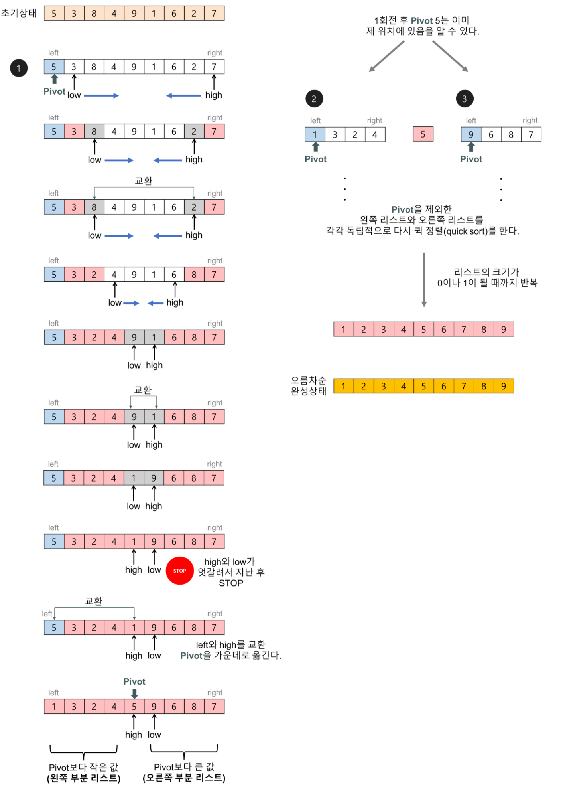

# 정렬 알고리즘

### Contents

- [선택 정렬(Selection sort)](#선택-정렬Selection-Sort)
- [삽입 정렬(Insertion sort)](#삽입-정렬Insertion-sort)
- [퀵 정렬(Quick sort)](#퀵-정렬Quick-sort)
- [계수 정렬(Counting sort)](#계수-정렬Counting-sort)


## 선택 정렬(Selection sort)

- **가장 작은것** 을 선택해서 앞으로 보내는 정렬 기법
- **가장 작은것** 을 선택하는데에 **N** 번 앞으로 보내는데에 **N** 번의 연산으로 **O(N<sup>2</sup>)** 의 시간복잡도를 가진다


``` c
#include <stdio.h>
#include <limits.h>

int swap(int* a, int* b) {
	int temp = *a;
	*a = *b;
	*b = temp;
}

int main(void) {

	int arr[10] = {3, 6, 2, 10, 7, 9, 5, 1, 4, 8};
	int size = sizeof(arr) / sizeof(int); // 배열에 넣을 데이터 갯수
	int min; // 정렬 기준을 정할 가장 작은 값
	int index; // 위치를 바꿔줄 인덱스

	// 데이터의 갯수만큼 반복
	for (int i = 0; i < size; i++) {
		
		// 최소값을 int 타입의 최대 값으로 초기화
		min = INT_MAX;

		// 현재 인덱스 i 부터 배열의 끝까지 반복
		for (int j = i; j < size; j++) {

			// 배열을 돌면서 현재 인덱스의 값이 min의 값보다 작은 경우
			if (min > arr[j]) {
				min = arr[j]; // min 값을 현재 인덱스의 값으로 업데이트
				index = j; // 현재 인덱스를 기억
			}
		}
		// 최종으로 가장 작은 값과 현재 인덱스의 값을 바꿔준다
		swap(&arr[i], &arr[index]);
	}


	for (int i = 0; i < size; i++) {
		printf("%d ", arr[i]);
	}
	printf("\n");

	/*
	실행 결과
	1 2 3 4 5 6 7 8 9 10
	*/

	system("pause");
	return 0;
}
```


## 삽입 정렬(Insertion sort)

- 각 숫자를 적절한 위치에 **삽입** 하는 정렬 기법
- **들어갈 위치를 선택** 하는데에 **N번** , **선택하는 횟수** 로 **N번** 으로 **O(N<sup>2</sup>)** 의 시간 복잡도를 가짐
- 시간 복잡도는 같지만 일반적으로 **선택 정렬(Selection sort)** 보다 빠르다


``` c
#include <stdio.h>

int swap(int* a, int* b) {
	int temp = *a;
	*a = *b;
	*b = temp;
}

int main(void) {

	int arr[10] = {3, 6, 2, 10, 7, 9, 5, 1, 4, 8};
	int size = sizeof(arr) / sizeof(int); // 배열에 넣을 데이터 갯수
	
	// 배열의 두번째 원소부터 끝까지 반복
	for (int i = 1; i < size; i++) {
		
        // 현재 인덱스에서부터 역방향으로 순회하며 값을 교체
        // 만약 arr[j] < arr[j - 1]이 만족하지 않는다면 그 이후는 이미 정렬 되어있는 상태이기 때문에 더이상 반복할 필요가 없음
		for (int j = i; j > 0 && arr[j] < arr[j - 1]; j--) {
			swap(&arr[j], &arr[j - 1]);
		}
	}
	
	for (int i = 0; i < size; i++) {
		printf("%d ", arr[i]);
	}
	printf("\n");

	/*
	실행 결과
	1 2 3 4 5 6 7 8 9 10
	*/

	system("pause");
	return 0;
}
```


## 퀵 정렬(Quick sort)

- **피벗** : 정렬 기준이 되는 숫자
- **피벗** 을 기준으로 큰 값과 작은 값을 서로 교체하는 정렬 기법
- 값을 **서로 교체** 하는데에 **N** 번, 엇갈린 경우 교체 이후에 원소가 반으로 나누어지므로 전체 원소를 나누는데에 평균적으로 **logN** 번이 소요되므로 평균적으로 **θ(N log N)** 의 시간 복잡도를 가진다
- 퀵 정렬을 편향된 분할이 발생할 때 연산의 양이 **O(N<sup>2</sup>)** 이다 따라서 보통 실제로 퀵 정렬을 구현하지는 않고 **C++**의 **Algorithm** 라이브러리의 `sort()` 함수를 사용하여  **O(N log N)** 의 시간 복잡도를 보장하는 퀵정렬을 사용한다



``` c
#include <stdio.h>

int arr[10] = { 1, 5, 7, 6, 2, 9, 8, 4, 10, 3 };

void swap(int *a, int *b) {
  int temp = *a;
  *a = *b;
  *b = temp;
}

void quickSort(int left, int right) {
  if (left >= right) return; // 왼쪽과 오른쪽이 같거나 오른쪽이 더 작다면 원소가 하나이거나 없기때문에 정렬이 완료된 것으로 함수를 바로 빠져나온다
  
  int pivot = left; // 피봇을
  int i = left;
  int j = right;
  
  // 피봇의 왼쪽에 피봇 보다 작은값, 오른쪽에 피봇보다 큰 값으로 모아준다
  while (i <= j) { // 엇갈릴 때까지 반복
    
    // arr[i]가 피봇보다 작으면 잘 위치해 있는것으로 판단하고 i를 다음으로 이동
    // arr[i]가 피봇보다 크면 피봇의 오른쪽에 위치해야 하므로 더이상 i를 이동시키지 않고 반복문 탈출
    while (i <= right && arr[i] <= arr[pivot]) {
      i++;
    }
    
    // arr[j]가 피봇보다 크면 잘 위치해 있는것으로 판단하고 j를 다음으로 이동
    // arr[j]가 피봇보다 작으면 피봇의 왼쪽에 위치해야 하므로 더이상 j를 이동시키지 않고 반복문 탈출
    while (j > left && arr[j] >= arr[pivot]) {
      j--;
    }
    
    
    if (i > j) {
      // i와 j가 엇갈리면 피봇과 j의 위치를 바꿔주고 엇갈렸기 때문에 반복문 탈출
      swap(&arr[pivot], &arr[j]);
      
    } else {
      // 아직 i와 j가 엇갈리지 않았다면 i와 j의 위치를 서로 바꿔주고 다음 반복문 실행
      swap(&arr[i], &arr[j]);
    }
  }
  
  // 피봇을 기준으로 다시 왼쪽과 오른쪽을 나누어 퀵정렬을 재귀적으로 호출한다
  quickSort(left, j - 1);
  quickSort(j + 1, right);
  
}

void show(int size) {
  for (int i = 0; i < size; i++) {
    printf("%d ", arr[i]);
  }
  printf("\n");
}

int main(int argc, const char * argv[]) {
  
  int left = 0;
  int size = sizeof(arr) / sizeof(int);
  
  printf("정렬 전: ");
  show(size);
  
  quickSort(left, size - 1);
  
  printf("정렬 후: ");
  show(size);
  
  /*
   실행 결과
   정렬 전: 1 5 7 6 2 9 8 4 10 3
   정렬 후: 1 2 3 4 5 6 7 8 9 10
   */
  
  return 0;
}

```


## 계수 정렬(Counting sort)

- 크기를 기준으로 데이터의 개수를 세는 정렬 알고리즘
- 각 데이터의 크기를 기준으로 분류하므로 **O(N)** 의 시간복잡도를 가진다
- 데이터의 최대 크기를 알고 있어야함
- 구현 방법
  1. **데이터의 최대 크기만큼의 임시 배열(모든 값은 0으로 초기화 되어있어야 함)** 을 만들어 두고 **정렬할 배열** 에서 값을 꺼내 **임시 배열** 의 `index` 로 사용한다
  2. **정렬할 배열** 에서 꺼낸 값을 **임시 배열** 의 `index` 로 접근해서 +1 해준다 (데이터의 갯수를 세는것)
  3. **임시 배열** 을 순회 하며 출력하면 정렬된 값이 출력 된다


``` c
#define _CRT_SECURE_NO_WARNINGS
#include <stdio.h>
#define MAX_VALUE 10001

int main(int argc, const char * argv[]) {
  
  int arr[MAX_VALUE] = {0, }; // 10001 크기의 배열 초기화
  
  int inputSize;
  printf("입력할 숫자의 갯수: ");
  scanf("%d", &inputSize);
  
  // 숫자를 입력 받을 때 마다 arr에 입력 받은 숫자를 index로 접근하여 해당 원소에 + 1 하며 원소의 숫자를 세어준다
  for (int i = 0; i < inputSize; i++) {
    int input;
    printf("입력할 숫자: ");
    scanf("%d", &input);
    arr[input]++;
  }
  
  // arr를 순회 하며 해당 index의 갯수만큼 index를 출력
  for (int i = 0; i < MAX_VALUE; i++) {

    while (arr[i] != 0) {
      printf("%d ", i);
      arr[i]--;
    }

  }
  
  /*
   실행 결과
   입력할 숫자의 갯수: 7
   입력할 숫자: 12
   입력할 숫자: 23
   입력할 숫자: 32
   입력할 숫자: 10
   입력할 숫자: 2
   입력할 숫자: 17
   입력할 숫자: 12
   2 10 12 12 17 23 32
   */
  return 0;
}
```

