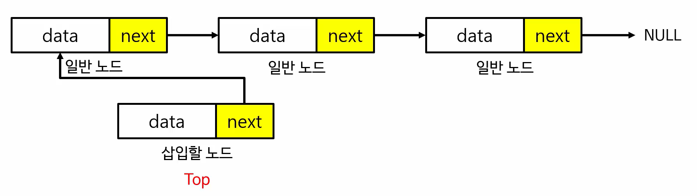
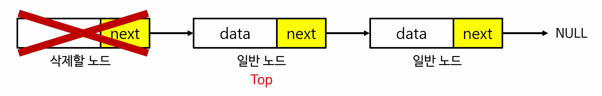

# 스택(Stack)

> 스택의 개념과 활용 방법


### Contents

- [개요](#개요)
- [구현](#구현)


## 개요

- **스택(Stack)** 은 한쪽으로 들어가서 한쪽으로 나오는 자료구조이다

  > First in Last out

- **PUSH** : 스택에서 데이터를 넣는다

- **POP** : 스택에서 데이터를 빼낸다


## 구현

- **스택(Stack)** 은 배열을 이용한 구현 방법과 연결 리스트를 이용한 구현 방법으로 나누어 진다


### 배열을 이용한 구현

``` c
#include <stdio.h>

#define SIZE 10000
#define INF 9999999

int stack[SIZE]; // 스택으로 사용할 배열 선언
int top = -1; // 스택에 들어가있는 데이터의 수를 나타낼 변수 선언

void push(int data) {

	if (top == SIZE - 1) { 
		// 스택의 SIZE가 꽉 찼을 경우 스택 오버 플로우
		printf("스택 오버플로우가 발생했습니다.\n");
		return;
	}

	// 스택의 맨 끝자리에 데이터를 넣어준다
	stack[++top] = data;
}

int pop() {

	if (top == -1) {
		// 더이상 꺼낼 데이터가 없으면 스택 언더 플로우
		printf("스택 언더플로우가 발생했습니다.\n");
		return -INF;
	}
	
	// 스택에서 데이터를 꺼낸 후 top 변수 1차감
	return stack[top--];
}

void show() {

	printf("--- 스택의 최상단 ---\n");

	for (int i = top; i >= 0; i--) {
		printf("%d\n", stack[i]);
	}

	printf("--- 스택의 최하단 ---\n");
}

int main(void) {

	push(7); // [7]
	push(5); // [7, 5]
	push(4); // [7, 5, 4]
	pop(); // [7, 5]
	push(6); // [7, 5, 6]
	pop(); // [7, 5]
	show();
	
	/*
	실행 결과
	--- 스택의 최상단 ---
	5
	7
	--- 스택의 최하단 ---
	*/
    
	system("pause");
	return 0;
}
```


### 연결 리스트를 이용한 스택 구현

- **PUSH**

  

- **POP**

  

``` c
#include <stdio.h>
#include <stdlib.h>
#define INF 9999999

typedef struct {
	int data;
	struct Node* next;
} Node;

typedef struct {
	Node* top;
} Stack;

void push(Stack* stack, int data) {
	
	Node* node = (Node*)malloc(sizeof(Node)); // push할 노드 동적할당
	node->data = data; // push할 노드에 데이터 할당
	node->next = stack->top; // push할 노드의 next를 스택의 top 할당
	
	stack->top = node; // 스택의 top에 push할 노드 할당
}

int pop(Stack* stack) {
	if (stack->top == NULL) {
		// 스택의 top이 NULL 이라면 데이터가 없는 상황이기 때문에 언더플로우
		printf("스택 언더플로우가 발생했습니다.\n");
		return -INF;
	}
	
	Node* node = stack->top; // 스택의 top을 꺼내 할당
	int data = node->data; // 반환할 데이터 세팅
	
	stack->top = node->next; // 스택의 top을 pop할 노드의 next로 교체
	
	free(node); // pop할 노드 메모리 해제
	
	return data; // 데이터 반환
}

void show(Stack* stack) {
	printf("--- 스택의 최상단 ---\n");

	Node* current = stack->top;

	while (current != NULL) {
		printf("%d\n", current->data);
		current = current->next;
	}

	printf("--- 스택의 최하단 ---\n");
}

int main(void) {

	// 스택을 명시적으로 초기화 해줌
	Stack stack;
	stack.top = NULL; // []
	show(&stack);
	
	push(&stack, 7); // [7]
	push(&stack, 5); // [7, 5]
	push(&stack, 4); // [7, 5, 4]
	pop(&stack); // [7, 5]
	push(&stack, 6); // [7, 5, 6]
	pop(&stack); // [7, 5]

	show(&stack);

	/*
	실행 결과
	--- 스택의 최상단 ---
	--- 스택의 최하단 ---

	--- 스택의 최상단 ---
	5
	7
	--- 스택의 최하단 ---
	*/

	system("pause");
	return 0;
}
```

