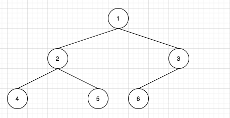
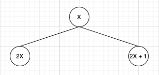

# 트리(Tree)

> 트리의 개념과 사용 방법


## Contents

- [개념](#개념)
- [용어](#용어)
- [트리의 종류](#트리의-종류)
- [트리의 표현](#트리의-표현)
- [이진 트리의 순회](#이진-트리의-순회)


## 개념

- Cycle이 없는 **연결그래프**
- DAG(Directed Acyclic Graph), 방향성이 있는 비순환 그래프의 한 종류  
- 트리는 하나의 루트 노드를 갖는다
- 루트 노드는 0개 이상의 자식 노드를 갖고 있다.
- 그 자식노드 또한 0개 이상의 자식노드를 갖고 있고, 이는 반복적으로 정의됨
- 비선형 자료구조로 계층적 관계를 표현한다. (디렉터리 구조, 조직도 등)
- 정점의 개수 **V** , 간선의 개수 **V - 1**
- 트리의 성질일뿐, 위를 만족한다고해서 트리는 아니다. **연결되어 있어야함**

## 용어

- **루트 노드(Root node)** : 부모가 없는 노드, 트리는 하나의 루트 노드만을 가진다.
- **단말 노드(Leaf node)** : 자식이 없는 노드 '말단 노드' 또는 '잎 노드' 라고도 부른다.
- **내부 노드(Internal node)** : 단말 노드가 아닌 노드
- **부모 노드(Parent node)** : 간선으로 연결되어있고 자기자신보다 레벨이 작은(위에 있는) 노드
- **자식 노드(Child node)** : 간선으로 연결되어있고 자기자신보다 레벨이 큰(아래에 있는)노드
- **형제 노드(Sibling node)** : 같은 부모를 가지는 노드
- **선조 노드(Ancestor node)** : 특정 노드에서 루트 노드까지의 모든 부모 노드
- **후손 노드(Descendant node)** : 특정 노드의 아래에 있는 모든 노드
- **레벨(Level)** : 루트 노드부터의 거리 (시작을 0 또는 1로)
- **깊이(Depth)** : 루트에서 부터의 거리
- **높이(Height)** : 깊이의 최댓값
- **차수(Degree)** : 자식 노드의 개수
- **노드의 크기(Size)** : 자신을 포함한 모든 자손 노드의 개수


## 트리의 종류

### Binary Tree(이진 트리)

> 자식을 최대 2개만 갖는 트리


#### 포화 이진 트리


- 모든 레벨의 node가 완전히 채워져 있다
- Leaf node를 제외한 나머지 노드의 자식 수가 2개
- 모든 Leaf node의 깊이가 같다
- 높이 **h** 인 트리의 노드의 개수 : 2<sup>h</sup> - 1


#### 완전 이진 트리

|                           A                            |                          B                           |                              C                               |
| :----------------------------------------------------: | :--------------------------------------------------: | :----------------------------------------------------------: |
|  |  |  |


- 마지막 레벨을 제외한 모든 레벨의 node가 완전히 채워져 있다
- 마지막 레벨의 node들은 왼쪽부터 채워져 있는 구조
- 포와 이진 트리도 완전 이진 트리에 포함된다
- A와 B는 완전 이진 트리 이지만 C는 마지막 node가 오른쪽 부터 채워져 있기때문에 완전 이진 트리가 아니다


### Non-Binary Tree

> 자식의 개수에 제한이 없는 트리


## 트리의 표현

- 트리는 그래프이기 때문에 그래프 표현과 같은 방식으로 한다
  - 트리는 루트가 있을 수도 없을 수도 있는데, 루트가 없다면 부모 자식 관계가 성립하지 않는 일반적인 그래프가 되기 때문 → 부모만 저장하는 것과 같다

### 루트가 있는 트리를 저장하는 방법

> 트리의 부모만 저장하는 방식


| i         | 1    | 2    | 3    | 4    | 5    | 6    | 7    |
| --------- | ---- | ---- | ---- | ---- | ---- | ---- | ---- |
| parent[i] | 0    | 1    | 1    | 2    | 2    | 3    | 3    |

- 부모만 저장하기 → 모든 노드는 부모를 1개 또는 0개 갖기 때문
- 부모가 없는 node는 루트
- 루트 node에는 트리가 1부터 시작한다면 `0`, 0부터 시작한다면 `-1` 저장


### 완전 이진 트리의 표현

- 1차원 배열로 표현 가능

  

  - 부모 노드가 `X`일 때 자식 노드는 왼쪽부터 `2X`, `2X + 1`의 관계를 가짐
  - 완전 이진 트리는 배열이 가장 효율적이다

- 포인터로 표현 가능

  ``` c
  // 추가 예정
  typedef struct Node {
    int data; // 데이터 저장 변수
    struct Node *left; // 왼쪽 자식 노드 포인터
    struct Node *right; // 오른쪽 자식 노드 포인터
  } Node;
  ```

  

## 이진 트리의 순회

- 트리의 모든 노드를 방문하는 순서.
- 트리는 그래프이기 때문에 DFS, BFS 모두 가능

### DFS 순회 방법

> 노드를 언제 처리할 것인지의 차이


- 전위 순회(Pre-Order)

  - 부모의 값을 이용해서 자식의 값을 구해야 할 때 사용할 수 있다.
  - 현재 노드 -> 왼쪽가지 -> 오른쪽 가지
  - `1` → `2` → `4` → `5` → `3` → `6` → `7`

  ``` c
  // 추가 예정
  ```

  

- 중위 순회(In-Order)

  - BST(Binary Search Tree)에서 삭제를 구현할 때 인오더 successor를 이용할때 사용할 수 있다.
- 왼쪽가지 -> 현재 노드 -> 오른쪽 가지
  - `4` → `2` → `5` → `1` → `6` → `3` → `7` 

  ``` c
// 추가 예정
  ```
  
  
  
- 후위 순회(Post-Order)

  - Dynamic Programming, Segment Tree등 트리를 사용하는 대부분의 알고리즘에서 사용됨
- 왼쪽가지 -> 오른쪽 가지 -> 현재 노드
  - `4` → `5` → `2` → `6` → `7` → `3` → `1`

  ``` c
// 추가 예정
  ```
  
  
  
    

